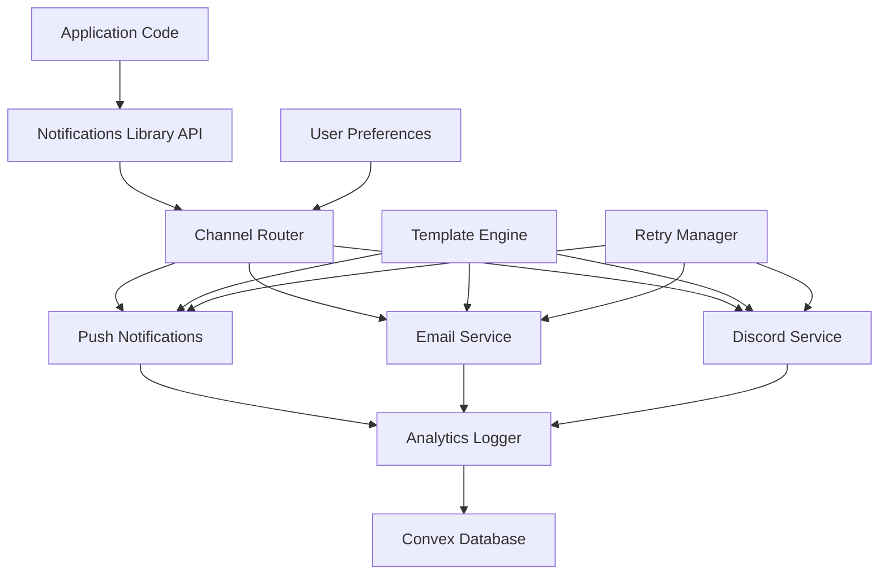

# Design Document

## Overview

The notifications library will be a comprehensive, unified system that extends the existing push notification infrastructure to support multiple communication channels including transactional emails, weekly summary emails, and Discord community notifications. The library will provide a clean API abstraction that handles channel routing, user preferences, templating, retry logic, and comprehensive logging.

The design builds upon the existing Convex-based push notification system (using web-push) while adding new service integrations including Resend for email delivery, and provides a unified interface that simplifies notification management across the ChainLink platform.

## Architecture

### High-Level Architecture



### Service Layer Architecture

The notifications library will be implemented as a service layer within the Convex backend, extending the existing `convex/notifications.ts` file with additional modules:

- **Core API** (`convex/notifications/index.ts`) - Main entry point and unified API
- **Channel Services** (`convex/notifications/channels/`) - Individual service implementations
- **Template Engine** (`convex/notifications/templates/`) - Message templating and personalization
- **Preference Manager** (`convex/notifications/preferences.ts`) - User preference handling
- **Analytics** (`convex/notifications/analytics.ts`) - Logging and metrics

## Components and Interfaces

### 1. Unified Notifications API

```typescript
// Main API interface
interface NotificationRequest {
  type: NotificationType;
  recipient: string; // User ID or external identifier
  templateId: string;
  data: Record<string, any>;
  channels?: NotificationChannel[]; // Optional channel override
  priority?: 'low' | 'normal' | 'high';
  scheduledFor?: Date;
}

interface NotificationResponse {
  id: string;
  status: 'queued' | 'sent' | 'failed';
  channels: ChannelResult[];
  timestamp: Date;
}

interface ChannelResult {
  channel: NotificationChannel;
  status: 'sent' | 'failed' | 'skipped';
  reason?: string;
  deliveryId?: string;
}
```

### 2. Channel Service Interface

```typescript
interface ChannelService {
  send(notification: ProcessedNotification): Promise<ChannelResult>;
  validateConfig(): Promise<boolean>;
  getDeliveryStatus(deliveryId: string): Promise<DeliveryStatus>;
}

// Implementations: PushService, EmailService, DiscordService
```

### 3. Template Engine

```typescript
interface NotificationTemplate {
  id: string;
  type: NotificationType;
  channels: {
    push?: PushTemplate;
    email?: EmailTemplate;
    discord?: DiscordTemplate;
  };
}

interface PushTemplate {
  title: string;
  body: string;
  icon?: string;
  actions?: PushAction[];
  data?: Record<string, any>;
}

interface EmailTemplate {
  subject: string;
  htmlBody: string;
  textBody: string;
  from?: string;
}

interface DiscordTemplate {
  content?: string;
  embeds?: DiscordEmbed[];
  username?: string;
}
```

### 4. User Preferences System

```typescript
interface NotificationPreferences {
  userId: string;
  channels: {
    push: ChannelPreference;
    email: ChannelPreference;
    discord: ChannelPreference;
  };
  types: Record<NotificationType, TypePreference>;
  quietHours?: QuietHours;
}

interface ChannelPreference {
  enabled: boolean;
  address?: string; // email address, discord webhook, etc.
}

interface TypePreference {
  enabled: boolean;
  channels: NotificationChannel[];
  frequency?: 'immediate' | 'batched' | 'weekly';
}
```

## Data Models

### 1. Enhanced User Schema

Extend the existing user schema to include comprehensive notification preferences:

```typescript
// Addition to convex/schema.ts
notificationPreferences: v.object({
  push: v.object({
    enabled: v.boolean(),
    types: v.record(v.string(), v.boolean())
  }),
  email: v.object({
    enabled: v.boolean(),
    address: v.optional(v.string()),
    types: v.record(v.string(), v.boolean()),
    frequency: v.union(v.literal("immediate"), v.literal("batched"), v.literal("weekly"))
  }),
  discord: v.object({
    enabled: v.boolean(),
    types: v.record(v.string(), v.boolean())
  }),
  quietHours: v.optional(v.object({
    enabled: v.boolean(),
    start: v.string(), // "22:00"
    end: v.string(),   // "08:00"
    timezone: v.string()
  }))
})
```

### 2. Notification Log Schema

```typescript
notificationLogs: defineTable({
  userId: v.string(),
  type: v.string(),
  templateId: v.string(),
  channels: v.array(v.object({
    channel: v.string(),
    status: v.string(),
    deliveryId: v.optional(v.string()),
    error: v.optional(v.string()),
    sentAt: v.optional(v.number())
  })),
  data: v.any(),
  createdAt: v.number(),
  scheduledFor: v.optional(v.number())
}).index("by_user", ["userId"])
  .index("by_type", ["type"])
  .index("by_created", ["createdAt"]);
```

### 3. Email Queue Schema

```typescript
emailQueue: defineTable({
  userId: v.string(),
  type: v.string(),
  templateId: v.string(),
  data: v.any(),
  scheduledFor: v.number(),
  status: v.union(v.literal("pending"), v.literal("sent"), v.literal("failed")),
  attempts: v.number(),
  lastAttempt: v.optional(v.number()),
  error: v.optional(v.string())
}).index("by_scheduled", ["scheduledFor"])
  .index("by_status", ["status"]);
```

## Error Handling

### 1. Retry Strategy

- **Exponential Backoff**: 1min, 5min, 15min, 1hr, 6hr, 24hr
- **Max Attempts**: 6 attempts for critical notifications, 3 for non-critical
- **Circuit Breaker**: Temporarily disable channels with high failure rates
- **Dead Letter Queue**: Store permanently failed notifications for manual review

### 2. Fallback Mechanisms

- **Channel Fallback**: If preferred channel fails, attempt secondary channels
- **In-App Notifications**: Always create in-app notification as final fallback
- **Admin Alerts**: Notify administrators of system-wide delivery issues

### 3. Error Classification

```typescript
enum NotificationError {
  INVALID_RECIPIENT = 'invalid_recipient',
  TEMPLATE_NOT_FOUND = 'template_not_found',
  CHANNEL_UNAVAILABLE = 'channel_unavailable',
  RATE_LIMITED = 'rate_limited',
  AUTHENTICATION_FAILED = 'auth_failed',
  CONTENT_REJECTED = 'content_rejected'
}
```

## Testing Strategy

### 1. Unit Testing

- **Template Rendering**: Test template compilation with various data inputs
- **Channel Services**: Mock external services and test error handling
- **Preference Logic**: Test user preference resolution and channel selection
- **Retry Logic**: Test exponential backoff and circuit breaker functionality

### 2. Integration Testing

- **End-to-End Flows**: Test complete notification delivery across all channels
- **External Service Integration**: Test with real email and Discord services in staging
- **Database Operations**: Test notification logging and queue management
- **User Preference Updates**: Test real-time preference changes

### 3. Performance Testing

- **Batch Processing**: Test weekly email generation for large user bases
- **Rate Limiting**: Test compliance with external service rate limits
- **Queue Processing**: Test notification queue under high load
- **Template Caching**: Test template compilation performance

### 4. Service-Specific Testing

#### Email Service Testing
- **Deliverability**: Test with various email providers and spam filters
- **Template Rendering**: Test HTML/text email rendering across clients
- **Bounce Handling**: Test bounce and complaint processing
- **Unsubscribe Flow**: Test one-click unsubscribe functionality

#### Discord Service Testing
- **Webhook Reliability**: Test Discord webhook delivery and error handling
- **Embed Formatting**: Test rich embed rendering and character limits
- **Rate Limiting**: Test Discord API rate limit compliance
- **Community Engagement**: Test notification effectiveness for user engagement

#### Push Notification Testing
- **Cross-Platform**: Test on iOS, Android, and web browsers
- **Action Handling**: Test notification action clicks and deep linking
- **Badge Updates**: Test app badge count updates
- **Background Delivery**: Test notification delivery when app is closed

### 5. User Experience Testing

- **Preference Management**: Test user preference UI and immediate effect
- **Notification Timing**: Test quiet hours and frequency preferences
- **Content Relevance**: Test notification personalization and relevance
- **Unsubscribe Experience**: Test easy opt-out and granular control

## Implementation Phases

### Phase 1: Core Infrastructure
- Unified API design and implementation
- Template engine development
- Enhanced user preference system
- Basic logging and analytics

### Phase 2: Email Integration
- Resend email service integration
- Transactional email templates
- Email queue and batch processing
- Bounce and complaint handling

### Phase 3: Enhanced Discord Integration
- Community engagement notifications
- Rich embed templates
- Multiple webhook support
- Community metrics integration

### Phase 4: Advanced Features
- Weekly summary email generation
- Advanced analytics and insights
- A/B testing framework for notifications
- Machine learning for optimal timing

### Phase 5: Optimization
- Performance optimization
- Advanced retry strategies
- Predictive delivery optimization
- Comprehensive monitoring dashboard