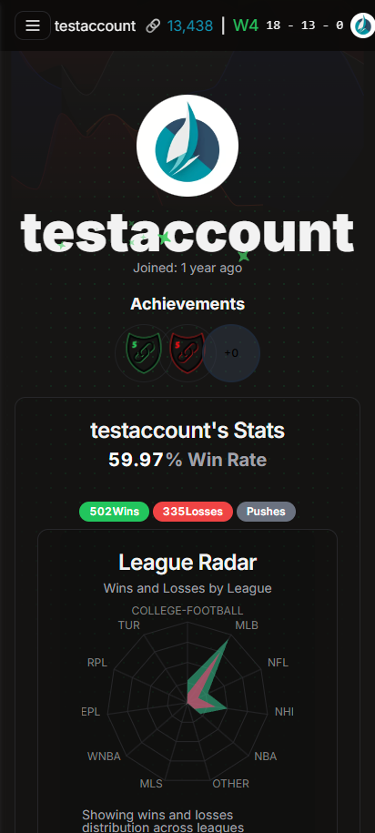
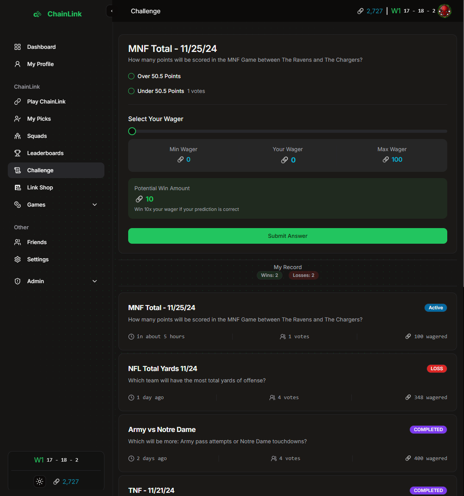

# ChainLink

ChainLink is a game where you try to build the highest chain of correct guesses to sports matchups and challenges. Wager your Links and climb the leaderboard to become the best ChainLink player in the world. Add your friends and build a squad to compete against other squads.

## Features

- [✔️] Matchups from: NFL, NBA, MLB, NHL, College Football, College Basketball, Soccer, Baseball, Lacrosse, UFL, Gatorade League, and more!
- [✔️] Compete in wagered challenges not tied to a specific matchup.
- [✔️] Earn 🔗Links for winning matchups and challenges.
- [✔️] Build a squad with your friends and compete against other squads.
- [✔️] Leaderboards for Chain, Wins, All Time Wins, and 🔗Links.
- [✔️] Achievements for completing various feats such as chain length or monthly wins.
- [✔️] Earn and spend 🔗Links at the Avatar Shop, Blackjack, and Slot Machine.
- [✔️] View your pick history and stat breakdowns
- [✔️] PWA and push notifications for staying connected on the go.
- [✔️] Sponsored Matchups and Dashboard ads with engagement tracking.
- [✔️] Administration dashboard.
- [ ] Pick Queue
- [ ] Pick 4
- [ ] Social Media Image Generator
- [ ] Rewarded Video Ads
- [ ] Brackets / Tournaments
- [ ] Email Summaries, Leaderboard, and Achievement notifications

## Preview

|  |  |
|------------------------|--------------------------|
  
    

  
    


[](https://star-history.com/#unmonk/chainlink&Date)


## Getting Started

To get started, clone the repository, fill in a .env.local file with the necessary environment variables, and run the following commands:

```
npm install
npm run dev
```
open [http://localhost:3000](http://localhost:3000)


## Built With

- [Next.js](https://nextjs.org/)
- [Convex](https://convex.dex/)
- [Clerk](https://clerk.dev/)
- [Shadcn/ui](https://shadcn/ui)
- [Serwist](https://github.com/serwist/serwist)